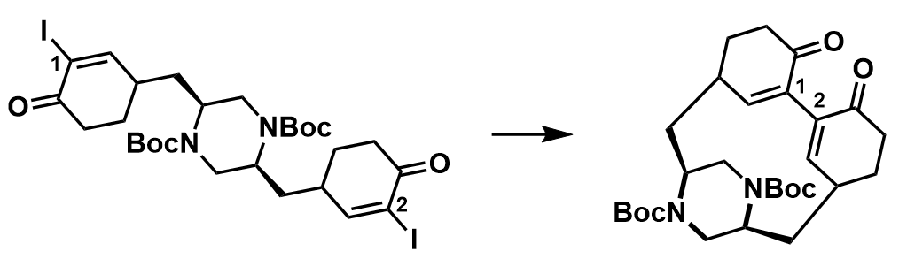

ABSTRACT:
-----
The Herquline family of natural products is a group of macrocyclic piperazines that display inhibition of influenza virus replication (Herquline A) and platelet aggregation (Herquline B). The central difficulties, and opportunities, of their synthesis are the formation of a strained biaryl C-C bond and the selective reductions of the dityrosine aromatic rings and amides. This literature review will focus on relevant PhD theses as well as the recently published work of the Wood group, the Baran group, and Schindler group (2018-2019) detailing the total synthesis of Herqulines B & C. 

Introduction
-----
Herqulines are a family of natural products isolated from Penicillium herquei consisting of the pentacyclic Herquline A and the tetracyclic Herqulines B & C. The phenolic oxidative coupling and dearomatizing reductions that compose their synthesis from tyrosine have been a field of active study since 2004. 

Figure 1: The Herquline family of natural products.

At the time of writing (April [], 2019) there were three articles published independently and in quick succession by the Wood group (2018/12/18), Baran group (2018/12/21), and Schindler group (2019/2/14) detailing the total syntheses of Herqulines B & C from tyrosine. In this literature review, I discuss the key transformations in the total synthesis of Herqulines and the development of the strategies employed to finally reach the target.

Ortho-Ortho Phenol Coupling
-----
All three of the above publications refer to a paper by the Tang group (2016) in which the biosynthesis of the Herqulines is thoroughly investigated. In this work, the Tang group confirms that these molecules are synthesized from two tyrosines and proposes a mechanism for the oxidative, radical coupling of the phenols. Thus a biomimetic retrosynthesis of the 1,4 diketone suggests the use of a phenolic coupling reaction to form the biaryl C-C bond. Even before this work by the Tang group, however, organic chemists were already working toward this goal.
Synthetic efforts on this front began in the 2000s with the PhD work of J. M. Hart. Her initial efforts focused on the use of various oxidative coupling reagents for the formation of phenol-phenol C-C bonds.

Table 1: Reagents screened by Hart for ortho-ortho phenol coupling.

|  Reagent  |        Result       |
|:---------:|:-------------------:|
| VOF3, TFA | No product observed |
| FeCl3     | No conversion       |
| Pb(OAc)2  | No conversion       |

However, this initial screen was not successful in finding conditions for the formation of the key C-C bond. Some reagents did have mild success in test systems but no conditions led to product for tyrosine derived substrates.
Hart then moved to coupling reactions, attempting palladium and nickel catalyzed Ullmann Couplings on protected, iodinated Tyr-Tyr peptides. But these either gave no results (Pd) or resulted in dehalogenation (Ni). The only coupling that yielded this difficult C-C bond was the Bowman Coupling. This little known reaction worked in intermolecular reactions between protected 3,5-diiodotyrosines but failed to yield any product for the intramolecular coupling of protected, diiodinated Tyr-Tyr peptides (Fig. 2). Ultimately, Hart’s PhD ended before the discovery of a robust methodology that could form this key bond. 
Stawski continued work on this frontier in his PhD thesis. Unlike Hart who started the synthesis from tyrosine, Stawski planned a synthesis starting from pyroglutamate. He successfully synthesized a piperazine intermediate that preceded the strained, biaryl C-C bond forming step. A diverse array of reaction conditions were attempted that included nickel, nickel/zinc, copper, and palladium catalyzed couplings. However, none were successful. 

Table 2: A selection of the methodologies attempted by Stawski.

| Conditions | Result |
|:----------:|:------:|
|Ni(PPh3)2Cl2, Zn, PPh3, NaH, THF, 90 &deg;C|decomposition|
|||
|||
|||
|||
|||

[Link](http://therealsalmon.github.io/files/total_synth_of_herq.pdf) to review.
